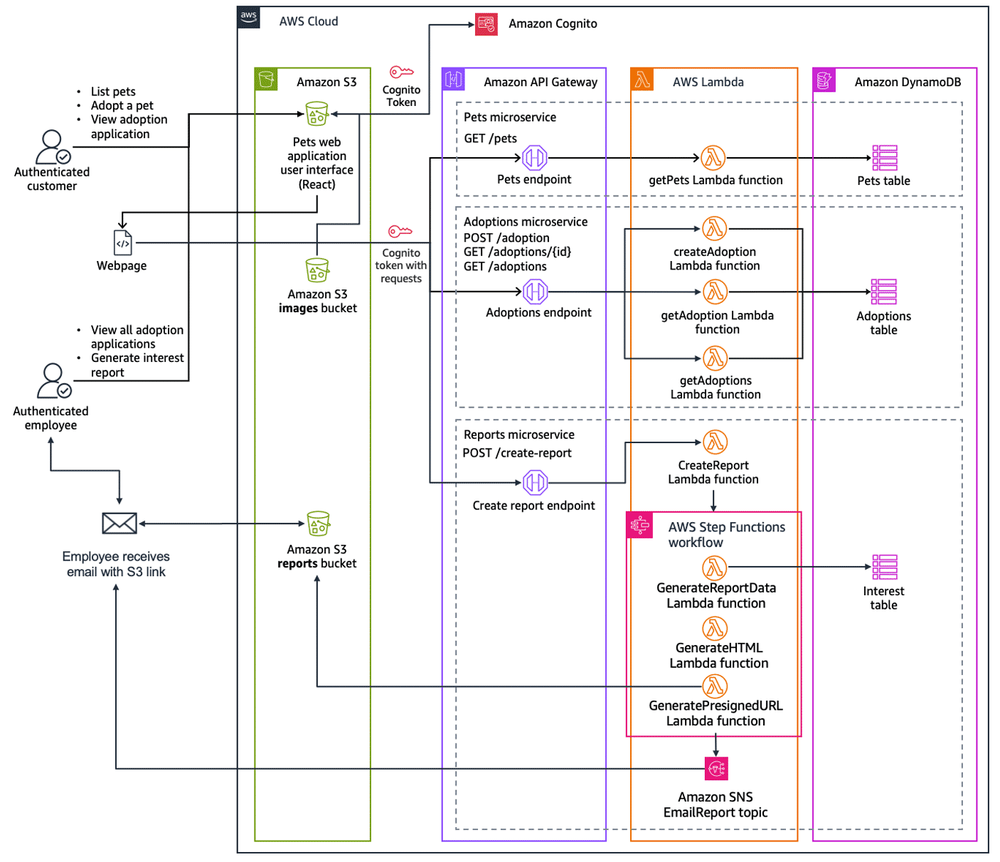

🐾 Pet Shelter Application

Summary: A serverless backend infrastructure for a pet shelter website, enabling efficient management of pet listings, adoption applications, and user engagement. Built with AWS Amplify and a full suite of AWS serverless services, defined using AWS SAM for infrastructure as code.

Features
✅ Manage pet listings and adoptions
✅ Secure user authentication and authorization
✅ Automated report generation with email delivery
✅ Scalable, event-driven serverless architecture

Tech Stack Service	Purpose

-AWS SAM	Infrastructure as Code (IaC) for defining the entire serverless app
-AWS Lambda	Serverless compute for backend logic
-Amazon DynamoDB	NoSQL data storage for pets, adoptions, and user interest
-Amazon API Gateway	RESTful API endpoints for frontend-backend interaction
-Amazon Cognito	User authentication and authorization
-AWS Step Functions	Orchestrates report generation workflows
-Amazon SNS	Sends automated email notifications

Architecture Overview
📂 Data Persistence
-PetsTable – Stores pet details (name, breed, age, status)
-AdoptionsTable – Tracks adoption applications (applicant info, status)
-PetsInterestTable – Captures user interest for analytics

API Endpoints (API Gateway + Lambda)
Method	Endpoint	Description	Auth
GET	/pets	Get list of available pets	Public
GET	/adoptions	Get all adoption records	Public
GET	/adoptions/{id}	Get adoption record by ID	Authenticated
POST	/adoptions	Submit adoption application	Public

User Authentication (Cognito)
User Pool: Manages signup, login, and recovery (email-based login, strong password policies)

User Pool Client: Enables OAuth flows for frontend integration

User Pool Domain: Hosted UI for user authentication, linked with protected API routes

📊 Automated Reporting (Step Functions + SNS)
1️⃣ GenerateReportDataLambda – Gathers data on pet interest/adoption trends
2️⃣ GenerateHTMLLambda – Formats data into an HTML report
3️⃣ GeneratePresignedUrlLambda – Creates a temporary secure URL for the report
4️⃣ State Machine: Orchestrates workflow steps
5️⃣ TriggerSNS – Publishes URL to SNS topic → sends email to stakeholders
6️⃣ CreateReportLambda – API-triggered Lambda to start report generation

